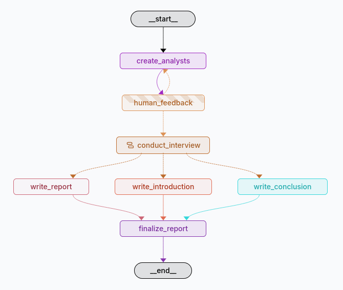
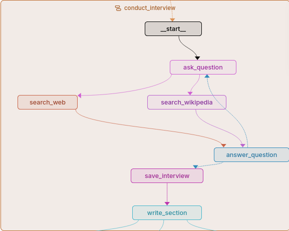

# **Research Assistant Agent**

This project builds an intelligent agent system that helps you perform **research automatically**.

You give the system:

* A **research topic**
* A **number of analysts/researchers**

The system then:

1. **Creates multiple analysts**
   Each analyst works independently in parallel.

2. **Runs expert interviews**
   An expert asks questions.
   Each question is turned into a **web search query** and fetched from:

   * Tavily
   * Wikipedia
     (Both happen in parallel to save time.)

3. **Analysts process the expert’s answers**
   Conduct Interview node is sub-graph. All analysts conduct their interviews in parallel, collecting insights.

4. **Generates a structured research report**
   The final output is organized into:

   * **Introduction**
   * **Main Content**
   * **Conclusion**

Below is the workflow graph used in the system:

  

Below is the detail of Conduct Interview Sub-graph used as node of above graph:



---

## **Installation & Setup**

### **1. Create a Virtual Environment**

This project was tested on **Python 3.13.5**.
Create and activate your virtual environment:

```bash
python -m venv venv
source venv/bin/activate   # Linux/Mac
venv\Scripts\activate      # Windows
conda create -n venv python=3.13.5 -y # conda
```

---

### **2. Install Dependencies**

```bash
pip install -r requirements.txt
```

---

### **3. Start the LangGraph Development Server**

```bash
langgraph dev
```

---

### **4. Configure Your API Keys**

Create a `.env` file in the project root and add:

```
GOOGLE_API_KEY="your_gemini_key"
LANGSMITH_API_KEY="your_langsmith_key"
TAVILY_API_KEY="your_tavily_key"
```

### **Where to Get API Keys**

* **Gemini** → [https://aistudio.google.com/api-keys](https://aistudio.google.com/api-keys)
* **Tavily** → [https://app.tavily.com/playground](https://app.tavily.com/playground)
* **LangSmith** → [https://smith.langchain.com/settings/apikeys](https://smith.langchain.com/settings/apikeys)

---
